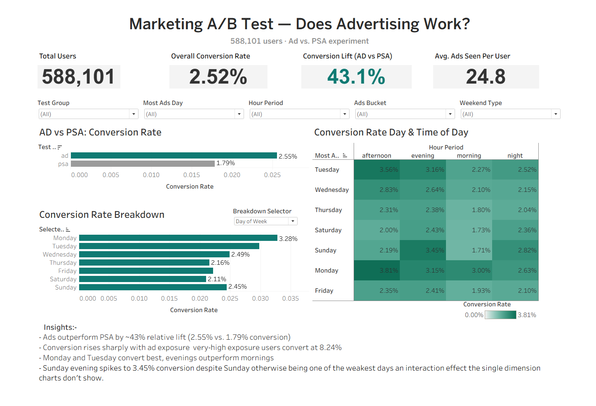

# Marketing A/B Test — Does Advertising Work?

An interactive Tableau dashboard analyzing a **588,101-user marketing A/B test** that compares a real ad campaign (`ad` group) against a public service announcement control (`psa` group) to measure whether advertising actually drives conversions.

**🔗 Live Dashboard (Tableau Public):** [Marketing A/B Test Dashboard](https://public.tableau.com/app/profile/saman.iqbal5804/viz/MarketingABTesting_17840419769310/MarketingABTestDashboard?publish=yes)

---

## Business Problem

A company ran a randomized experiment: most users were shown a marketing ad (the treatment), while a smaller holdout group was shown a neutral PSA instead (the control). The goal of this dashboard is to answer three questions a marketing stakeholder would ask:

1. Did showing ads actually increase conversions compared to the control group?
2. Does the amount of ad exposure a user receives affect their odds of converting?
3. Is there a better day or time to concentrate ad delivery?

## Dataset

- **File:** `marketing_AB_cleaned.csv`
- **Size:** 588,101 rows (one row per user), no missing values, no duplicate users
- **Target variable:** `converted` — whether the user completed the desired conversion action

| Column | Description |
|---|---|
| `user_id` | Unique anonymized user identifier |
| `test_group` | `ad` (treatment — shown the marketing ad) or `psa` (control — shown a public service announcement) |
| `converted` / `converted_int` | Whether the user converted (boolean / 0-1 encoding) |
| `total_ads` | Total number of ads the user was shown during the campaign |
| `most_ads_day` | Day of week the user received the most ads |
| `most_ads_hour` | Hour of day (0–23) the user received the most ads |
| `hour_period` | Derived bucket of `most_ads_hour`: morning / afternoon / evening / night |
| `ads_bucket` | Derived bucket of `total_ads`: low / medium / high / very_high |
| `is_weekend` | Whether `most_ads_day` falls on a weekend |

No cost, revenue, or demographic data is available, so the dashboard focuses on **conversion rate and exposure patterns** rather than ROI.

---

## KPI Summary

| KPI | Value |
|---|---|
| **Total Users** | 588,101 |
| **Overall Conversion Rate** | 2.52% |
| **Conversion Lift (Ad vs. PSA)** | +43.1% |
| **Avg. Ads Seen per User** | 24.8 |

---

## Dashboard Components

### 1. Ad vs. PSA — Conversion Rate
A horizontal bar chart comparing the two experiment arms directly:
- **Ad group:** 2.55% conversion rate
- **PSA (control) group:** 1.79% conversion rate

This is the headline result of the experiment — users who saw the ad converted at a meaningfully higher rate than those who only saw the PSA, confirming the campaign had a real, measurable effect.

### 2. Conversion Rate Breakdown (interactive, parameter-driven)
A single chart that switches between three different breakdowns using a **"Breakdown Selector" parameter** — no need for three separate charts:
- **Day of Week** *(shown by default)* — Monday leads at 3.28% conversion, followed by Tuesday; Saturday is the weakest day at 2.11%.
- **Time of Day** — evenings and afternoons outperform mornings and nights.
- **Ad Exposure Level** — conversion rises sharply with more ads seen, from ~0.23% in the low-exposure bucket up to 8.24% in the very-high bucket.

### 3. Conversion Rate by Day & Time of Day (heat map)
A cross-tabulated heat map of every day × time-of-day combination, color-shaded from light (0.00%) to dark teal (3.81%). This chart exists specifically to catch **interaction effects** that the single-dimension breakdown above can't show — for example:
- **Monday afternoon (3.81%)** is the single best-performing cell in the entire dataset.
- **Sunday evening (3.45%)** spikes sharply even though every other Sunday time slot is among the weakest in the dataset (Sunday morning is the lowest cell overall, at 1.71%).

### 4. Interactive Filters
Five filters sit at the top of the dashboard and control every chart and KPI simultaneously:
- **Test Group** (Ad / PSA)
- **Most Ads Day**
- **Hour Period**
- **Ads Bucket**
- **Weekend Type**

---

## Key Insights

- **Ads outperform PSA by a ~43% relative lift** (2.55% vs. 1.79% conversion) — a statistically significant result, not random noise.
- **Conversion rises sharply with ad exposure** — users in the very-high exposure bucket convert at 8.24%, far above the low-exposure baseline.
- **Monday and Tuesday convert best overall; evenings outperform mornings.**
- **Sunday evening is an outlier** — it spikes to 3.45% conversion despite Sunday otherwise being one of the weakest days, an interaction effect only visible in the day × time heat map.

## Limitations

- The experiment groups are heavily imbalanced (96% Ad vs. 4% PSA), so the control group's estimate carries more uncertainty than the ad group's.
- No cost, revenue, or demographic data exists, so ROI and audience segmentation are out of scope.
- `total_ads` and exposure timing describe the whole campaign per user, not individual events, so a true time-series trend isn't possible with this data.
- The dose-response relationship between `total_ads` and conversion is correlational — it does not by itself prove that more ads *cause* conversion, since more-engaged users may simply have been shown more ads.

---

## Tools Used
- **Tableau Public** — dashboard design, calculated fields, parameters, and publishing
- **Python (pandas)** — initial data exploration and validation

## Author
Built by [Saman Iqbal] as part of a data analytics portfolio project.
